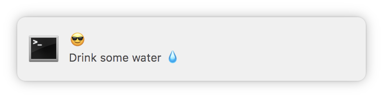

# caretaker

A tiny script written in reason that will send you nice notifications like:



## Usage

```shell
npm install -g @relekang/caretaker
caretaker # to run it
# or run in the background
caretaker > /dev/null &
```

Options:
* `--standing-desk` - Will add the message stand for a bit every once in a while.
* `--fast` - Fast mode for development turns minutes into 100ms

## Development

```shell
yarn
yarn build # or yarn watch
```
